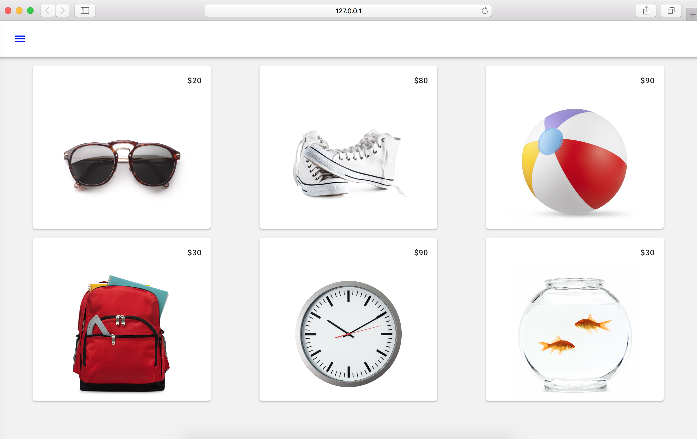

<!--docs:
title: "Building Beautiful Sites"
layout: landing
section: codelabs
path: /codelabs/beautiful-sites-simplified/
-->

<!--
This is a simplified version of Building Beautiful Sites with MDC web
edited for a non-technical audience
-->

# Building Beautiful Sites Faster with Material Components for the Web

## Introduction

Developed by a core team of engineers and UX designers at Google, Material Components (MDC) helps developers execute Material Design. MDC has over 20 beautiful and functional UI components for the web platform and is also available for Android and iOS.

This codelab will show you some situations where Material Components for the web (MDC-Web) can make your app more functional and beautiful, while saving you engineering time.

## What you will build

In this codelab, you're going to complete Shrine, an e-commerce app that sells clothing and home goods. Your app will:

- Use a fixed header bar - called a toolbar in MDC-Web  - to display a title using [Material Design’s typography guidelines](https://material.io/guidelines/style/typography.html) and a navigation icon complete with a [Material Design ink ripple](https://material.io/guidelines/motion/material-motion.html#material-motion-how-does-material-move) effect.
- Contain a side [navigation drawer](https://material.io/guidelines/patterns/navigation-drawer.html) displaying a Material Design list of different product categories.
- Display a list of product [cards](https://material.io/guidelines/components/cards.html#) using [layout grid](https://material.io/guidelines/layout/responsive-ui.html#responsive-ui-breakpoints) , providing a beautiful experience regardless of form factor.

{: .codelab-img}

## Components you'll be using

- Card
- Toolbar
- Ripple
- Drawer
- List
- Layout Grid

Code blocks are for you to simply copy and paste.

[Next step: Set up your development environment](./1-setup.md)
